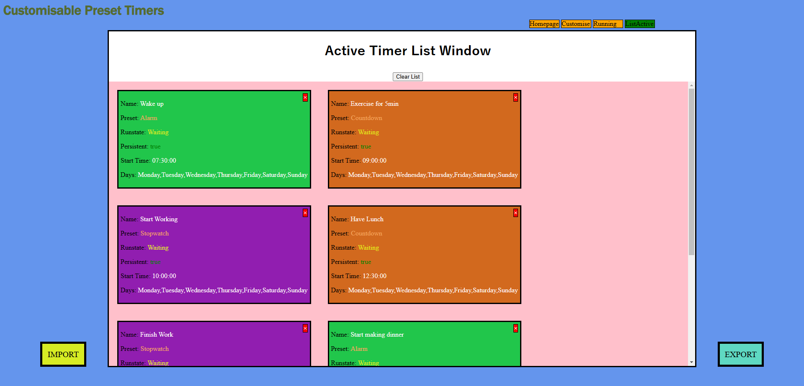
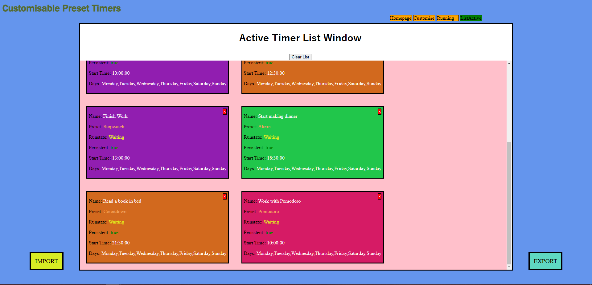

# Customisable Preset Timers 

Customisable Preset Timers is a single-page web application that will be developed and presented to universities with the premise of supporting young people’s education. 
It will allow them to keep a regimen of their day and notify them of any upcoming activities they have set while they are using their device. This will significantly reduce unwanted time spent on addicting apps for any 
student who wants to create a routine with important responsibilities. The student will be able to set a timer to account for these responsibilities at any time at any day(s) of the week. The most important feature of 
this app is that it is customisable, allowing students to personalise each timer to their own situation and schedule. Furthermore, ‘preset’ timers that enhance productivity will be included in the application, 
meaning the student/user will only need to configure options that are relevant without it being confusing or tedious. Although the application is intended primarily for students, it can be used by anyone and will
be useful for those who regularly use their device. 

## example

